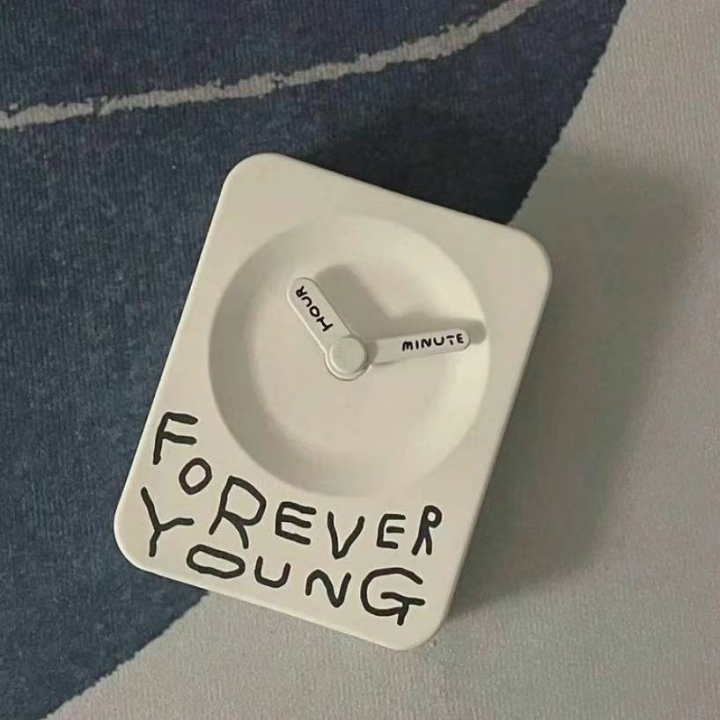
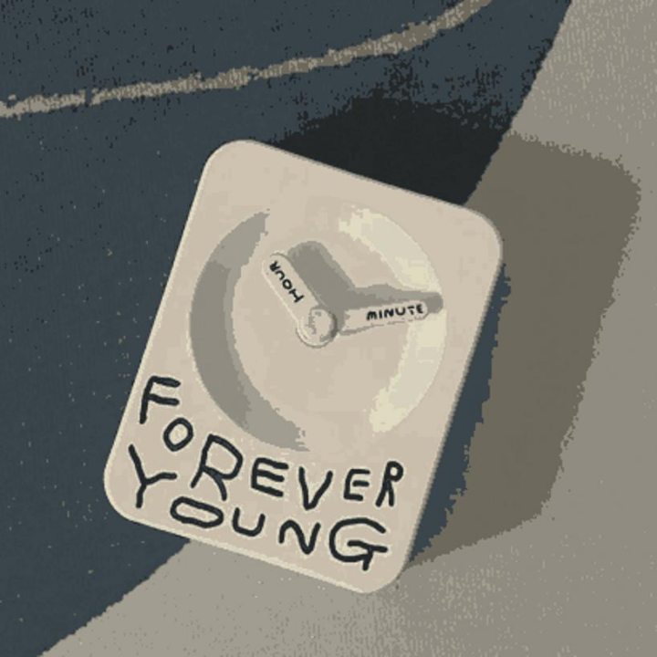

<!--
 * @Author: SheathedSharp z404878860@163.com
 * @Date: 2024-06-06 12:57:12
-->

  
      |  ) 
  

# color-quantization-compressor
This is a color image compression tool based on KMeans clustering and dynamic programming.

## Main Features and Structure
- Image Compression:
    - Support image size adjustment
    - Use KMeans for color clustering
    - Color quantization through dynamic programming

- File Structure:
    - Image file storage (img directory)
    - Compressed data storage (npz directory)
    - Core compression class (colorful_image_compressor.py)
    - Usage example (example.py)

- Main Parameters:
    - n_clusters: Number of color clusters
    - max_colors: Maximum number of colors
    - resize_factor: Image scaling factor

## Testing
We tested using a color image with 818*818 resolution and size of 79.49KB. Tests were conducted with different numbers of clusters and colors.
|  |  |
|:---:|:---:|
| Original Image | Compressed Image (8 clusters, 2 colors) |

Detailed test results are shown in the table below (where 'n' represents the number of clusters and 'c' represents the number of colors):
| Filename                     | Original Size (KB) | Compressed File Size (KB) | Decompressed Image Size (KB) | 
|------------------------------|-------------------|--------------------------|---------------------------|
| reconstructed_image2_n4_c2   | 79.49             | 29.5                     | 41.7                      |
| reconstructed_image2_n4_c4   | 79.49             | 49.3                     | 45.2                      |
| reconstructed_image2_n4_c8   | 79.49             | 70.9                     | 51.3                      |
| reconstructed_image2_n4_c16  | 79.49             | 94.3                     | 59.3                      |
| reconstructed_image2_n8_c2   | 79.49             | 48.3                     | 48.7                      |
| reconstructed_image2_n8_c4   | 79.49             | 73.3                     | 52.5                      |
| reconstructed_image2_n8_c8   | 79.49             | 101                      | 59.1                      |
| reconstructed_image2_n8_c16  | 79.49             | 125                      | 61.1                      |